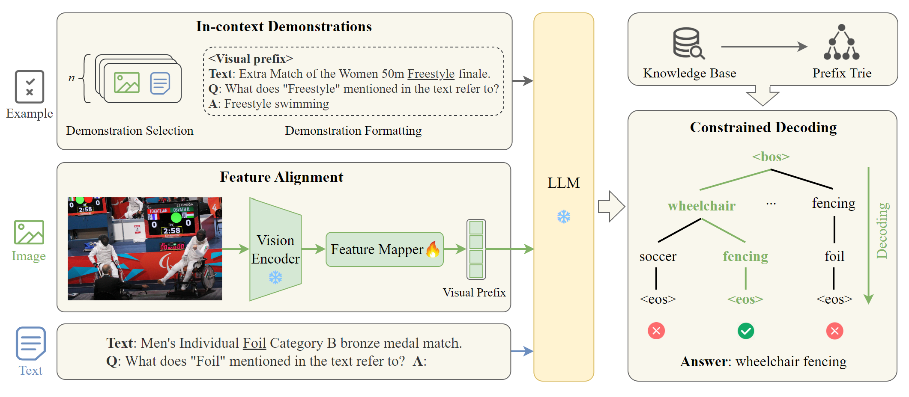

<<<<<<< HEAD
# GEMEL: Generative Multimodal Entity Linking

<div align="center">

 [Overview](https://github.com/HITsz-TMG/GEMEL#sparkles-overview) | [News](https://github.com/HITsz-TMG/GEMEL#fire-news) | [Architecture](https://github.com/HITsz-TMG/GEMEL#rocket-architecture) | [Usage](https://github.com/HITsz-TMG/GEMEL#rotating_light-usage) | [Citation](https://github.com/HITsz-TMG/GEMEL#citation)

</div>


## :sparkles: Overview

This repository contains the official implementation of our **LREC-COLING 2024** paper, [**Generative Multimodal Entity Linking**](https://arxiv.org/abs/2306.12725).

GEMEL is a simple yet effective Generative Multimodal Entity Linking framework based on Large Language Models (LLMs), which directly generates target entity names. We keep the vision and language model frozen and only train a feature mapper to enable cross-modality interactions. Extensive experiments show that, with only ~0.3% of the model parameters fine-tuned, GEMEL achieves state-of-the-art results on two well-established MEL datasets, namely [WikiDiverse](https://arxiv.org/abs/2204.06347) and [WikiMEL](https://dl.acm.org/doi/abs/10.1145/3477495.3531867). The performance gain stems from mitigating the popularity bias of LLM predictions and disambiguating less common entities effectively. Our framework is compatible with any off-the-shelf language model, paving the way towards an efficient and general solution for utilizing LLMs in the MEL task.

**Checkpoints** and preprocessed **data** can be accessed [here](https://drive.google.com/drive/folders/1M2wF2RkWpzeCKYj032bOryVPMM_DSubE?usp=sharing).

If you have any question, please feel free to contact me via email at shisenbaohit@gmail.com or submit your issue in the repository.

## :fire: News

[23.07.14] We release the codes and the checkpoints of GEMEL.

[24.03.19] We have updated our paper.

## :rocket: Architecture

[Here](https://arxiv.org/abs/2306.12725), you can see the detailed architecture and some experimental analyses of GEMEL.

<p align="center" width="60%"></p>

## :rotating_light: Usage

### Environment

```
conda create -n GEMEL python=3.7
conda activate GEMEL
pip install -r requirements.txt
```
For different CUDA versions you need to install the corresponding PyTorch package. Find the appropriate installation package on the [PyTorch](https://pytorch.org/get-started/previous-versions/) website. To install PyTorch, we use the following command:

```
pip install torch==1.12.0+cu116 torchvision==0.13.0+cu116 torchaudio==0.12.0 --extra-index-url https://download.pytorch.org/whl/cu116
```


### Data
We have preprocessed the text, image, and knowledge base data. Download data from [here](https://drive.google.com/drive/folders/1M2wF2RkWpzeCKYj032bOryVPMM_DSubE?usp=sharing) and move to the `./data` folder. [Here](https://github.com/Senbao-Shi/How-to-Build-and-Use-a-Prefix-Tree/tree/main) we offer guidelines on how to build and use a prefix tree for constrained decoding.

```
train.json, dev.json, test.json         ->      textual data files
clip_vit_large_patch14_1024.hdf5        ->      visual data file
prefix_tree_opt.pkl                     ->      prefix tree of entity name
SimCSE_train_mention_embeddings.pkl     ->      training set mention embeddings
```

### Train
Running `main.py` directly will use the WikiDiverse dataset, opt-6.7b model:

```
python main.py
```

The model structure is in model.py, the default parameters are in params.py, and most of the data processing is in utils.py.

You can customize some parameter settings, see `params.py` for details. Here are some examples of how to train GEMEL:

For training with the WikiDiverse dataset:
```
python main.py --dataset wikidiverse --model_name opt-6.7b --ICL_examples_num 16
```

For training with the WikiMEL dataset:
```
python main.py --dataset wikimel --model_name opt-6.7b --ICL_examples_num 16
```

### Test
Download the checkpoint from [here](https://drive.google.com/drive/folders/1M2wF2RkWpzeCKYj032bOryVPMM_DSubE?usp=sharing) and move to the `./checkpoint` folder.

For testing on WikiDiverse test set:
```
python infe.py --dataset wikidiverse --model_name opt-6.7b --best_ckpt opt-6.7b_wikidiverse_linear_4token_16examples_82_77.pkl
```

For testing on WikiMEL test set:
```
python infe.py --dataset wikimel --model_name opt-6.7b --best_ckpt opt-6.7b_wikimel_linear_4token_16examples_75_53.pkl
```


## Citation
```
@article{shi2023generative,
  title={Generative Multimodal Entity Linking},
  author={Shi, Senbao and Xu, Zhenran and Hu, Baotian and Zhang, Min},
  journal={arXiv preprint arXiv:2306.12725},
  year={2023}
}
```


=======
📌 [View Poster (PDF)](./poster.pdf)

# 🧪 Poisoning Attacks on Multimodal Entity Linking Models

This project explores how **data poisoning attacks** can undermine the performance and reliability of **Multimodal Entity Linking (MEL)** systems. MEL aims to associate entity mentions in text, images, and videos with corresponding entries in a structured knowledge base. However, adversarial actors can inject poisoned data into training sets to manipulate or mislead model predictions.

## 📄 Paper

You can read the full research paper here:  
[🔗 Poisoning Attacks on Multimodal Entity Linking Models (PDF)](https://zenodo.org/records/15844783)

## 📚 Datasets

- **[WikiDiverse (Wang et al., 2022)]**: 7,824 image-text pairs, 16,327 mentions.
- **[WikiMEL (Luo et al., 2023)]**: 22,136 image-text pairs, 25,846 mentions.

Both datasets were split into training, validation, and test sets, following an 8:1:1 and 7:1:2 ratio respectively.

## 🏗️ Model Architecture: GEMEL

The GEMEL (Generative Multimodal Entity Linking) model architecture consists of three core components:

1. **Vision-Language Alignment**  
   Projects image features into the text embedding space using a frozen image encoder and a trainable visual prefix mapper.

2. **In-Context Learning (ICL)**  
   Provides multimodal demonstrations to guide the LLM in generating accurate entity predictions.

3. **Constrained Decoding**  
   Uses a prefix tree of valid entity names to restrict output to knowledge base entries.

## 🧪 Poisoning Techniques

We apply **textual data poisoning** using:

### 1. [TextAttack (Morris et al., 2020)](https://arxiv.org/abs/2005.06620)
- *Embedding*: Synonym replacement without changing sentence embeddings.
- *WordNet*: Semantic swaps using WordNet synonyms.
- *RandomSwap*: Character-level perturbations.

### 2. [CLARE (Li et al., 2020)](https://arxiv.org/abs/2009.07502)
- Context-aware infilling using Replace, Insert, and Merge operations.
- Experiments conducted with poisoning rates: 10%, 20%, 30%, and 40%.

## 🛠️ Infrastructure

- Trained on **HiPerGator (UF HPC)** with A100 GPUs.
- Sentence embeddings generated using **SimCSE**.
- Poisoning generated using **TextAttack** and **CLARE** pipelines.

## 👥 Authors

- [Malvika Jadhav](mailto:jadhav.m@ufl.edu)
- [Sam Maley](mailto:smaley@ufl.edu)

## 📄 Citation

If you use or build on this work, please cite:

```bibtex
@misc{jadhav2025mel,
  author       = {Malvika Jadhav and Samuel Maley},
  title        = {Multimodal Entity Linking under Adversarial Settings},
  year         = 2025,
  publisher    = {Zenodo},
  doi          = {10.5281/zenodo.15844783},
  url          = {https://doi.org/10.5281/zenodo.15844783}
}
>>>>>>> dc1396f155f66bf8e66ee34f26e7e67ded8cb14f
